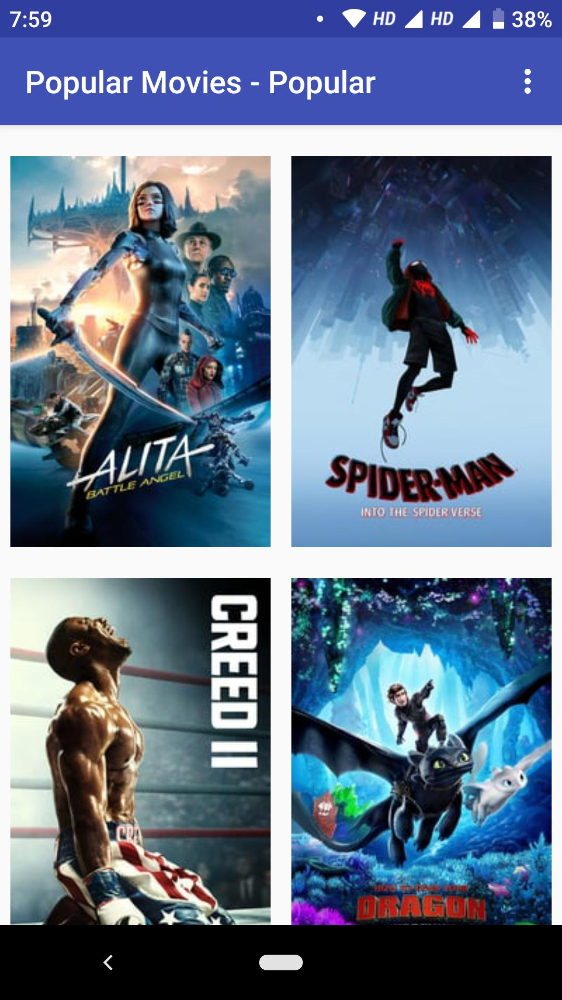
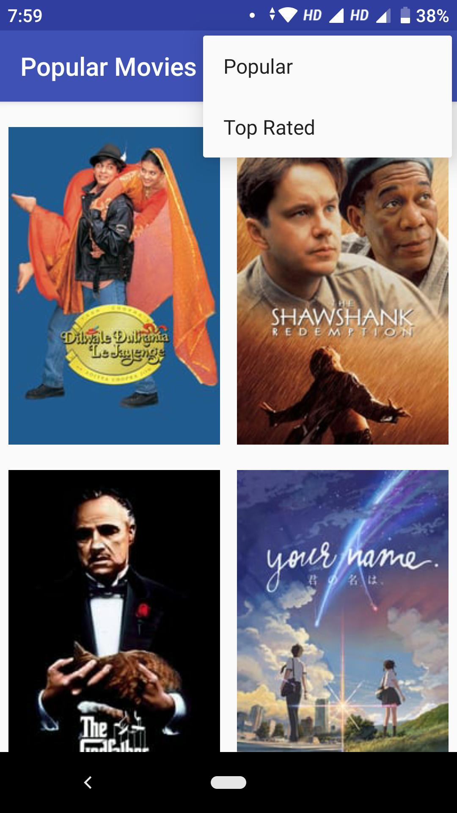
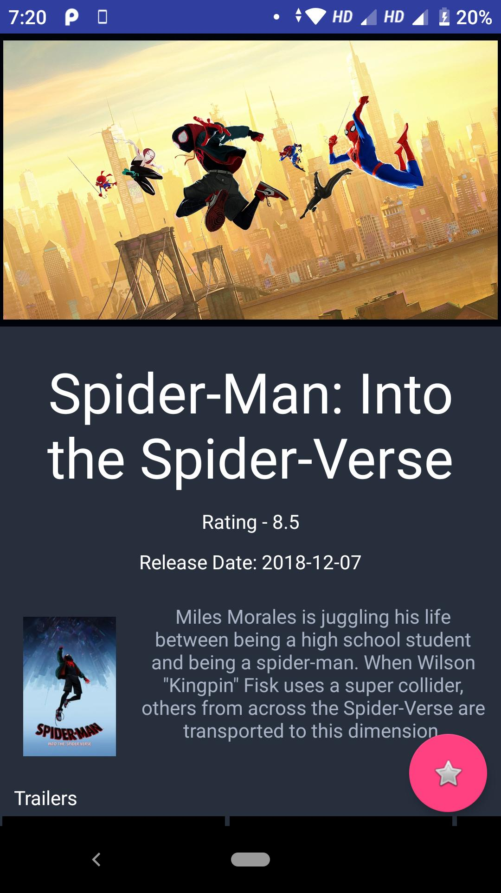
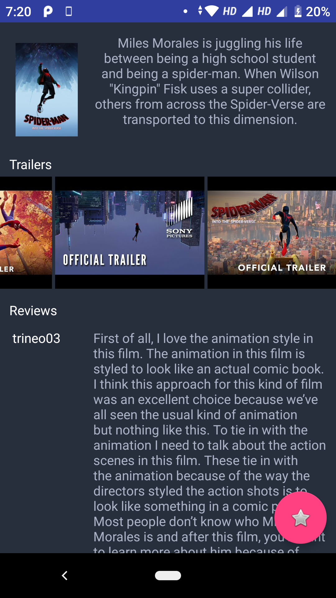

# Popular Movies Application

Here is an android application for the Udacity Popular movies project. The app shows a list of popular/top rated movies that’s also optimized for tablets. In addition the app allows users to save favorites (for offline view), play trailers and read user reviews for a particular movie. Fetches movie information using themoviedb.org web API.

# PROJECT SPECIFICATION
# User-Interface - Layouts
- UI contains an element (e.g., a spinner or settings menu) to toggle the sort order of the movies by: most popular, highest rated.
- Movies are displayed in the main layout via a grid of their corresponding movie poster thumbnails.
- UI contains a screen for displaying the details for a selected movie.
- Movie Details layout contains title, release date, movie poster, vote average, and plot synopsis.
- Movie Details layout contains a section for displaying trailer videos and user reviews.
# User-Interface - Function
- When a user changes the sort criteria (most popular, highest rated, and favorites) the main view gets updated correctly.
- When a movie poster thumbnail is selected, the movie details screen is launched.
- When a trailer is selected, app uses an Intent to launch the trailer.
- In the movies detail screen, a user can tap a button(for example, a star) to mark it as a Favorite.
# Network API implementation
- In a background thread, app queries the /movie/popular or /movie/top_rated API for the sort criteria specified in the settings menu.
- App requests for related videos for a selected movie via the /movie/{id}/videos endpoint in a background thread and displays those details when the user selects a movie.
- App requests for user reviews for a selected movie via the /movie/{id}/reviews endpoint endpoint in a background thread and displays those details when the user selects a movie.
# Data Persistance
- The titles and IDs of the user’s favorite movies are stored in a native SQLite database and are exposed via a ContentProvider. This ContentProvider is updated - whenever the user favorites or unfavorites a movie. No other persistence libraries are used.
- When the "favorites" setting option is selected, the main view displays the entire favorites collection based on movie ids stored in the ContentProvider.
# Libraries used
- Recyclerview
- Cardview
- Picasso
- Butterknife

# Screenshots

  
  

